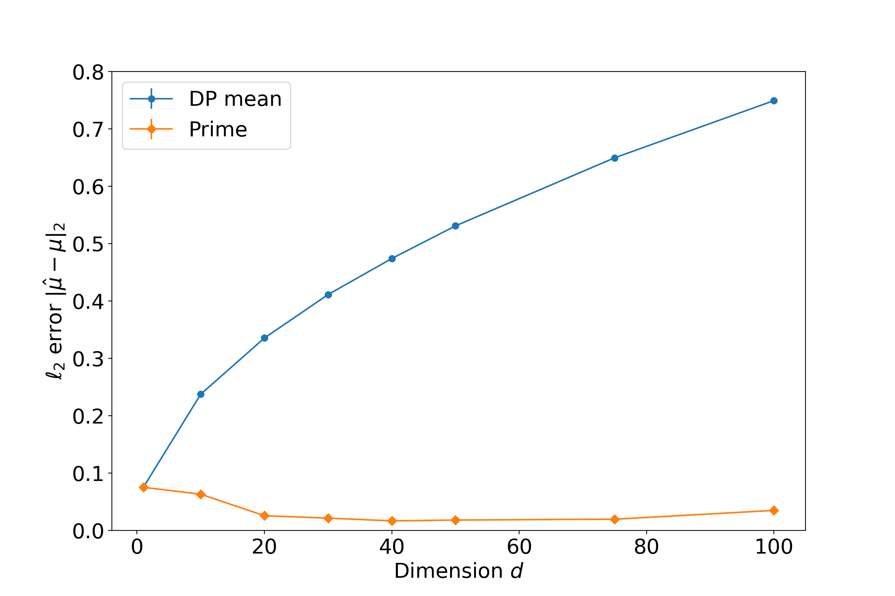

# Robust and differentially private mean estimation
This repository contains the code to this paper: 

[Robust and differentially private mean estimation](https://arxiv.org/abs/2102.09159).

Authors: Xiyang Liu, Weihao Kong, Sham Kakade, Sewoong Oh

# Summary

Differentially private mean estimation is brittle against a small fraction of the samples being corrupted by an adversary. We show that robustness can be achieves without any increase in the sample complexity by introducing a novel mean estimator. The innovation is in leveraging the resilience property of well-behaved distributions in an innovative way to not only find robust mean (which is the typical use case of resilience) but also  bound sensitivity for optimal privacy guarantee. 
However, this algorithm takes an exponential time. We therefore propose an efficient algorithm that achieves the optimal target accuracy at the cost of an increase of sample complexity. With appropriately chosen parameters, 
we show that  our exponential time approach achieves near-optimal guarantees for both sub-Gaussian and covariance bounded distributions, and our efficient approach achieves target optimal accuracy  but at the cost of an extra 
 factor in the sample complexity. 

# Experiment

Private mean estimators (e.g., DP mean [[1]](#1)) is vulnerable to adversarial corruption especially in high dimensions, while the proposed PRIME achieves   robustness (and privacy) regardless of the dimension of the samples. Both are -DP and  fraction of data is corrupted. Each data point is repeated 50 runs and standard error is shown as the error bar. 

<a id="1">[1]</a> Gautam Kamath, Jerry Li, Vikrant Singhal, and Jonathan Ullman. Privately learning high-dimensional
distributions. In Conference on Learning Theory, pages 1853–1902, 2019.

## License
[MIT](https://github.com/xiyangl3/robust_dp/blob/main/LICENSE).